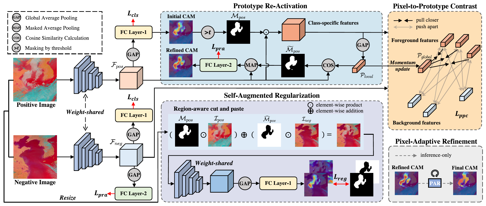
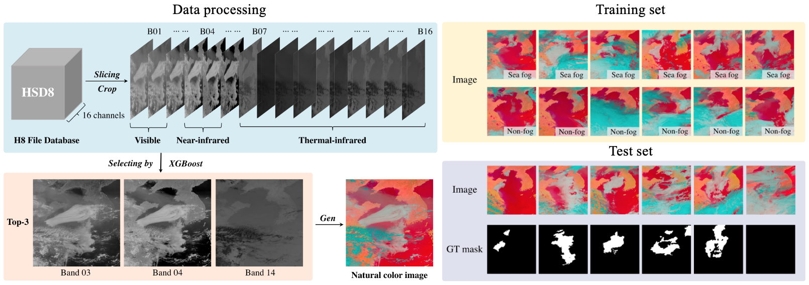

# ProCAM-TGRS2023

This repository is the official PyTorch implementation of [***Weakly Supervised Sea Fog Detection in Remote Sensing Images via Prototype Learning***](https://ieeexplore.ieee.org/abstract/document/10278477), published by *IEEE Transactions on Geoscience and Remote Sensing* (TGRS). 

This repository also provides the access to the [***WS-SFDD***](#data-preparation) dataset, which consists of 4291 image-level labeled sea fog remote sensing images collected by Himawari-8, covering sea fog events occurred in the Yellow Sea and the Bohai Sea from 2017 to 2021.

## Framework



## Dataset



## Install

- Clone this repo:

    ```bash
    git clone https://github.com/yixianghuang/ProCAM.git
    cd ProCAM
    ```

- Create a conda virtual environment and activate it:

    ```bash
    conda env create -f environment.yml
    conda activate ProCAM
    ```

## Data Preparation

The ***WS-SFDD*** dataset can be accessed via [**Google Drive**](https://drive.google.com/file/d/1c6JaZTxMohoesa50AEameoMxPUjrMABc/view?usp=sharing).

You can extract the downloaded data into the folder ```<YOUR DATASET ROOT>``` and create a symbolic link:

```bash
ln -s <YOUR DATASET ROOT> ./data/WS_SFDD
```

The dataset structure will be:

```
WS_SFDD
    ├── test
    │   ├── img
    │   └── mask
    ├── test.txt
    ├── train
    │   ├── img
    └── train.txt
```

## Getting Started

### Step 1: Train ProCAM and generate pseudo masks.

- Please specify a workspace to save the model and logs.

    ```bash
    CUDA_VISIBLE_DEVICES=0,1 python run_sample.py --data_root ./data/WS_SFDD --work_space ./data/workspace --log_name sample_train --train_cam_pass True --train_procam_pass True --make_procam_pass True
    ```

- (Optional) To generate and evaluate pseudo masks on the test set, change ```--img_list```:

    ```bash
    CUDA_VISIBLE_DEVICES=0 python run_sample.py --data_root ./data/WS_SFDD --work_space ./data/workspace --log_name sample_eval --make_procam_pass True --eval_cam_pass True --mask_dir procam_mask_test --img_list test.txt
    ```

### Step 2: Train a semantic segmentation network.

We provide the code for training U-Net. You can also train your model with generated pseudo masks.

- Enter the folder ```<Segmentation>```:

    ```bash
    cd Segmentation
    ```

- Create a mask folder for the training set and put pseudo masks into it:

    ```
    cp -r ../data/workspace/procam_mask ../data/WS_SFDD/train/mask
    ```

- Train U-Net:

    ```bash
    CUDA_VISIBLE_DEVICES=0,1 python train_dist_unet.py --dataset ws_sfdd --model unet \
                --data_root ../data/WS_SFDD --model_root ../data/workspace/unet_epoch80_lr0.0001_bz32 \
                --epochs 80 --batch-size 32 --lr 0.0001
    ```

- Evaluate the metrics:

    ```bash
    CUDA_VISIBLE_DEVICES=0 python test.py --dataset ws_sfdd --model unet \
                --data_root ../data/WS_SFDD --model_root ../data/workspace/unet_epoch80_lr0.0001_bz32 \
                --split test --mode val --flip --ms
    ```

- Save the predicted masks:

    ```bash
    CUDA_VISIBLE_DEVICES=0 python test.py --dataset ws_sfdd --model unet \
                --data_root ../data/WS_SFDD --model_root ../data/workspace/unet_epoch80_lr0.0001_bz32 \
                --split test --mode test --flip --ms\
                --save_folder ../data/workspace/unet_epoch80_lr0.0001_bz32/output_mask
    ```

## Citation

If you find this work useful for your research, please consider citing our paper:

   ```bibtex
   @article{huang2023weakly,
    title={Weakly Supervised Sea Fog Detection in Remote Sensing Images via Prototype Learning},
    author={Huang, Yixiang and Wu, Ming and Jiang, Xin and Li, Jiaao and Xu, Mengqiu and Zhang, Chuang and Guo, Jun},
    journal={IEEE Transactions on Geoscience and Remote Sensing},
    year={2023},
    publisher={IEEE}
   }
   ```